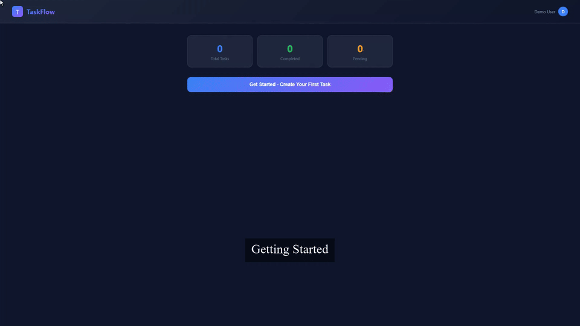

<div align="center">

# demo-machine

<picture>
  <source media="(prefers-color-scheme: dark)" srcset="assets/banner.dark.png" />
  <source media="(prefers-color-scheme: light)" srcset="assets/banner.light.png" />
  
</picture>

**Demo as code**: turn versioned specs into repeatable browser captures and polished product demo videos.

[](LICENSE)
[](https://www.npmjs.com/package/demo-machine)
[](https://nodejs.org)
[](tests/)
[](https://playwright.dev)
[](https://ffmpeg.org)

[Quick Start](#quick-start) &bull; [CLI](docs/cli-reference.md) &bull; [Spec](docs/spec-reference.md) &bull; [MCP](docs/mcp.md) &bull; [Roadmap](ROADMAP.md)

</div>

---

## What It Does

demo-machine reads a `.demo.yaml` spec, launches your app, drives a real browser with Playwright, records the run, and renders a polished MP4.

Use it when you want product demos that are:

- Repeatable instead of manually re-recorded.
- Version-controlled next to app code.
- Reviewable through artifacts like traces, screenshots, manifests, and quality reports.
- AI-assisted through the built-in MCP server.

It is local-first. There is no required cloud service and no current CI dependency.

## Demo

This video was generated from [examples/showcase/todo-app.demo.yaml](examples/showcase/todo-app.demo.yaml):



More rendered examples are in the [demo gallery](docs/demo-gallery.md).

## Quick Start

```bash
git clone https://github.com/45ck/demo-machine.git
cd demo-machine
pnpm install
pnpm exec playwright install chromium
pnpm build
node dist/cli.js run examples/showcase/todo-app.demo.yaml --no-headless
```

Requirements:

- Node.js >= 22
- pnpm
- FFmpeg on your `PATH`
- Chromium installed through Playwright

The rendered video is written to a safe per-run folder:

```text
output/todo-app/<run-id>/output.mp4
```

For a slower walkthrough, use [Getting Started](GETTING-STARTED.md). For every command and option, use the [CLI reference](docs/cli-reference.md).

## Basic Commands

```bash
# Full pipeline: capture + render + quality checks
demo-machine run <spec.yaml>

# Validate before spending time on capture
demo-machine validate <spec.yaml>

# Create a starter spec
demo-machine init my-product.demo.yaml --url http://localhost:3000 --command "pnpm dev"

# Capture only
demo-machine capture <spec.yaml>

# Re-render from a previous capture
demo-machine edit <output-dir>/events.json

# Find examples to copy from
demo-machine examples list
demo-machine examples show controls-lab

# Check local dependencies
demo-machine doctor
```

## Examples

Example specs are organized by purpose:

- `examples/showcase/`: polished demos used by the docs and gallery.
- `examples/proof/actions/`: small action-level playback proofs.
- `examples/proof/variants/`: redaction and narration-sync coverage variants.
- `examples/assurance/long-demo/`: a longer realistic QA flow for full-video assurance.

`examples/manifest.json` is the source of truth for discovery and suite tooling. `demo-machine examples list` reads that manifest and, by default, shows showcase and assurance specs. Use `--type proof` for action fixtures, `--type all` for every manifest entry, and filters such as `--tag`, `--signal`, `--tier`, or `--search` to narrow the table. `demo-machine examples show <slug>` prints the canonical spec path, variants, quality signals, and runnable `run` and `validate` commands.

## How It Works

```text
spec file
  -> validate
  -> start app
  -> drive browser
  -> capture video + events + trace + screenshots
  -> render MP4
  -> write verification + quality artifacts
```

Default runs write to `output/<spec-slug>/<run-id>` and update `output/latest.json`. If you pass `--output <dir>`, demo-machine uses that exact directory and refuses to overwrite known demo artifacts unless you also pass `--overwrite`.

Key artifacts:

- `output.mp4`: rendered demo video
- `video.webm`: raw browser recording
- `events.json`: captured action timeline
- `verification.json`: capture proof and artifact contract
- `environment.json`: runtime/browser context
- `quality.json`: post-render checks
- `trace.zip`: Playwright trace for debugging

## Spec Example

```yaml
meta:
  title: "My Product Demo"

runner:
  command: "pnpm dev"
  url: "http://localhost:3000"
  healthcheck: "http://localhost:3000/health"

chapters:
  - title: "First look"
    steps:
      - action: navigate
        url: "/"
      - action: click
        target:
          by: role
          role: button
          name: "Get Started"
      - action: screenshot
        name: first-screen
```

Prefer structured targets such as `role`, `label`, `text`, and `testId` before raw CSS selectors. See the [spec reference](docs/spec-reference.md) for all fields, actions, targets, narration, and redaction.

## AI / MCP

demo-machine includes an MCP server so AI assistants can help create, validate, run, review, and repair demos.

```json
{
  "mcpServers": {
    "demo-machine": {
      "command": "npx",
      "args": ["demo-machine-mcp"]
    }
  }
}
```

The MCP server exposes 5 tools, 4 resources, and 8 prompts. See the [MCP guide](docs/mcp.md) for the full list.

## Local Quality

```bash
pnpm validate
pnpm local-ready
pnpm release-ready:fast
pnpm release-ready
pnpm examples:validate -- --no-build
pnpm examples:smoke:pr -- --limit 2
pnpm video:assure -- --filter assurance-long-demo
pnpm qa:meta-prompt
```

`pnpm validate` runs lint, formatting, spelling, typecheck, tests, dependency checks, and strict verification inventory checks. `pnpm local-ready` adds build and example validation. `pnpm release-ready:fast` adds release gates without rendering smoke videos, while `pnpm release-ready` runs the heavier PR-tier capture/render smoke and video assurance. `pnpm examples:validate` validates manifest-backed specs, and `pnpm video:assure` scans rendered MP4 outputs for blank frames, frozen spans, and large visual jumps after rendered example outputs exist.

`pnpm qa:meta-prompt` creates a fresh complex fixture project plus a Demo Machine Codex skill and prompt. Use `pnpm qa:meta-prompt:run` when you want Codex CLI to create narrated demos, cover the action/component matrix, run Demo Machine, self-evaluate, and produce a human review page at `output/meta-prompt-qa/review.html`.

## Learn More

Start here:

- [Getting Started](GETTING-STARTED.md): first run, starter specs, validation flow.
- [CLI Reference](docs/cli-reference.md): commands, options, and output behavior.
- [Spec Reference](docs/spec-reference.md): fields, actions, targets, narration, and redaction.
- [Demo Anything](docs/demo-anything.md): authoring principles, supported actions, and example matrix.
- [Examples Assurance Layout](docs/examples-assurance-plan.md): organized examples layout, suite validation, video assurance, and long-demo QA.
- [MCP Integration](docs/mcp.md): AI assistant tools, resources, and prompts.
- [Verification Matrix](docs/verification-matrix.md): what local checks prove and how coverage is tracked.
- [Demo Gallery](docs/demo-gallery.md): rendered example previews.
- [Roadmap](ROADMAP.md): project direction, priorities, and non-goals.

Then go deeper:

- [Glossary](docs/glossary.md): shared terms for artifacts and pipeline stages.
- [Contributing](CONTRIBUTING.md): development workflow and quality gates.
- [Releasing](RELEASING.md): local release process.
- [Security](SECURITY.md): supported versions and vulnerability reporting.

## License

[MIT](LICENSE)
